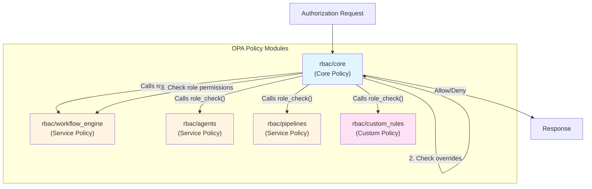
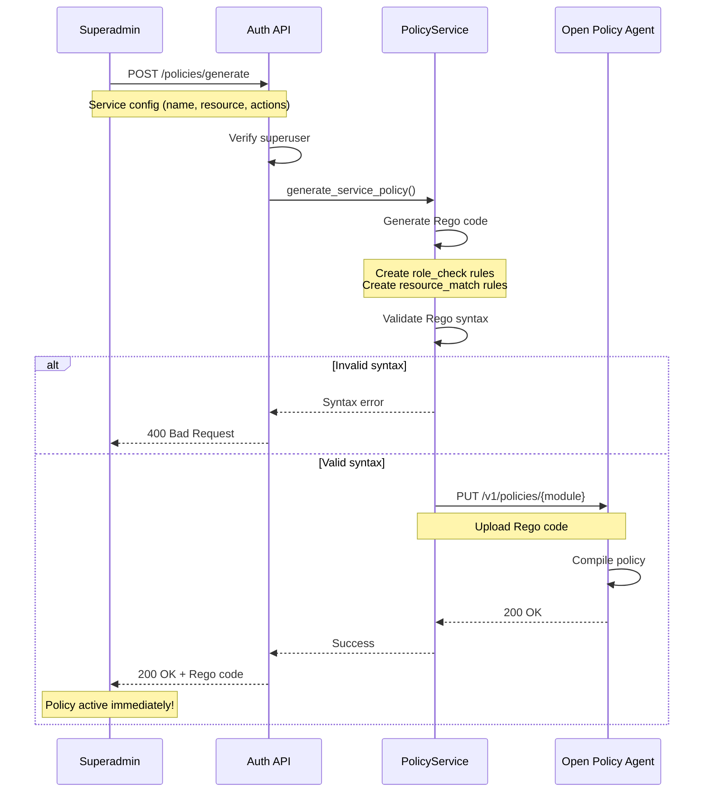

# RBAC System Overview - Presentation Guide

## Table of Contents

1. [Executive Summary](#executive-summary)
2. [Architecture Overview](#architecture-overview)
3. [Role Hierarchy](#role-hierarchy)
4. [Permission Model](#permission-model)
5. [Request Flow](#how-it-works---request-flow)
6. [Database Schema](#database-schema)
7. [OPA Policy](#opa-policy-simplified)
8. [Dynamic Policy Management](#dynamic-policy-management-superadmin-feature)
9. [SDK Usage Examples](#sdk-usage-examples)
10. [Performance & Production Readiness](#performance--production-readiness)
11. [Migration from Old RBAC](#migration-from-old-rbac)
12. [API Reference](#api-reference)
13. [Policy Management Use Cases](#policy-management-use-cases)
14. [Common Actions by Role](#common-actions-by-role)
15. [Questions & Answers](#questions--answers)
16. [Next Steps](#next-steps)

---

## Executive Summary

We've implemented a production-ready, OPA-based Role-Based Access Control (RBAC) system that provides:

- **Centralized authorization** via Open Policy Agent (OPA)
- **Dynamic policy management** - Superadmins can create/modify policies without code changes
- **4-tier role hierarchy** (Superadmin → Admin → Editor → Viewer)
- **Multi-tenancy support** (Organization → Account → Project)
- **Permission overrides** for fine-grained control
- **High performance** (208x speedup with caching, 1M+ req/s throughput)
- **Production-ready** (147 tests, 99.49% coverage)

---

## Architecture Overview

```
┌─────────────────────────────────────────────────────────────────┐
│                        Client Application                        │
│                    (Workflow Engine, Agent Studio, etc.)         │
└────────────────────────────┬────────────────────────────────────┘
                             │
                             │ Headers: X-Project-ID, X-Account-ID, X-Organization-ID
                             │ Auth: Bearer token or API key
                             ▼
┌─────────────────────────────────────────────────────────────────┐
│                          RBAC SDK                                │
│  ┌──────────────────┐  ┌──────────────────┐  ┌───────────────┐ │
│  │ Principal        │  │ Resource         │  │ Permission    │ │
│  │ Resolver         │  │ Builder          │  │ Guard         │ │
│  │ (Who?)           │  │ (What?)          │  │ (Action?)     │ │
│  └──────────────────┘  └──────────────────┘  └───────────────┘ │
└────────────────────────────┬────────────────────────────────────┘
                             │
                             │ POST /check_access
                             ▼
┌─────────────────────────────────────────────────────────────────┐
│                         Auth API                                 │
│  ┌──────────────────────────────────────────────────────────┐   │
│  │ 1. Validate user exists and is ACTIVE                    │   │
│  │ 2. Fetch role assignments from database                  │   │
│  │ 3. Fetch permission overrides (if any)                   │   │
│  │ 4. Call OPA with user + action + resource                │   │
│  │ 5. Return allow/deny decision                            │   │
│  └──────────────────────────────────────────────────────────┘   │
└────────────────────────────┬────────────────────────────────────┘
                             │
                             │ POST /v1/data/rbac/allow
                             ▼
┌─────────────────────────────────────────────────────────────────┐
│                    Open Policy Agent (OPA)                       │
│  ┌──────────────────────────────────────────────────────────┐   │
│  │              Policy: rbac.rego                           │   │
│  │                                                          │   │
│  │  1. Check user status (must be "active")                │   │
│  │  2. Check permission overrides (deny list first)        │   │
│  │  3. Check permission overrides (allow list)             │   │
│  │  4. Fall back to role-based permissions                 │   │
│  │  5. Return true/false                                   │   │
│  └──────────────────────────────────────────────────────────┘   │
└─────────────────────────────────────────────────────────────────┘
```

---

## Role Hierarchy

### 4-Tier System

| Role | Scope | Permissions | Use Case |
|------|-------|-------------|----------|
| **Superadmin** | Organization | Full access to everything in the org | CTO, Platform Admin |
| **Admin** | Account | Full access to account + all projects | Team Lead, Department Head |
| **Editor** | Project | Can edit and view project | Developer, Data Scientist |
| **Viewer** | Project | Read-only access | Stakeholder, Auditor |

### Resource Hierarchy

```
Organization (UUID)
  ├─ Account 1 (UUID)
  │   ├─ Project A (UUID)
  │   ├─ Project B (UUID)
  │   └─ Project C (UUID)
  └─ Account 2 (UUID)
      ├─ Project D (UUID)
      └─ Project E (UUID)
```

**Inheritance Rules:**
- Superadmin on Organization → Access to ALL accounts and projects
- Admin on Account → Access to ALL projects in that account
- Editor/Viewer on Project → Access ONLY to that specific project

---

## Permission Model

### Role-Based Permissions (Default)

Each role has a predefined set of permissions:

**Superadmin:**
- All actions on all resources in the organization

**Admin:**
- All actions on account and its projects
- Cannot modify organization settings

**Editor:**
- `view_project`, `edit_project`, `execute_workflow`, `create_workflow`, etc.
- Cannot delete project or manage users

**Viewer:**
- `view_project`, `view_workflow`, `view_execution`
- Read-only access

### Permission Overrides (Advanced)

Override role-based permissions for specific users on specific resources:

```json
{
  "user_id": 123,
  "resource_id": "project-uuid",
  "resource_type": "project",
  "allow_actions": ["delete_project"],  // Grant extra permission
  "deny_actions": ["execute_workflow"]  // Revoke permission
}
```

**Evaluation Order:**
1. ❌ **Deny list** (highest priority - always blocks)
2. ✅ **Allow list** (grants access even if role doesn't have it)
3. 🔄 **Role-based** (fallback to role permissions)

---

## How It Works - Request Flow

### Example: User wants to view a workflow

**1. Request arrives:**
```http
GET /workflows/abc-123
Headers:
  Authorization: Bearer eyJhbGc...
  X-Project-ID: 550e8400-e29b-41d4-a716-446655440000
  X-Account-ID: 550e8400-e29b-41d4-a716-446655440001
  X-Organization-ID: 550e8400-e29b-41d4-a716-446655440002
```

**2. RBAC SDK extracts:**
- **Principal:** User ID from JWT token
- **Action:** `view_workflow`
- **Resource:**
  ```json
  {
    "type": "project",
    "id": "550e8400-e29b-41d4-a716-446655440000",
    "account_id": "550e8400-e29b-41d4-a716-446655440001",
    "organization_id": "550e8400-e29b-41d4-a716-446655440002"
  }
  ```

**3. Auth API checks:**
- User exists? ✓
- User status = "active"? ✓
- Fetch role assignments:
  ```json
  [
    {
      "user_id": 123,
      "role": "editor",
      "resource_type": "project",
      "resource_id": "550e8400-e29b-41d4-a716-446655440000"
    }
  ]
  ```

**4. OPA evaluates policy:**
```rego
# User is active ✓
# No deny overrides ✓
# No allow overrides (skip)
# Check role: editor on project ✓
# Action "view_workflow" in editor permissions? ✓
# Result: ALLOW
```

**5. Response:**
```json
{
  "allowed": true
}
```

**6. Request proceeds** to workflow handler

---

## Database Schema

### Core Tables

**`users`** - User accounts
```sql
id              SERIAL PRIMARY KEY
email           VARCHAR UNIQUE
status          VARCHAR  -- 'active', 'inactive', 'suspended', 'pending'
created_at      TIMESTAMP
```

**`user_role_assignments`** - Role assignments
```sql
user_id         INTEGER REFERENCES users(id)
resource_id     UUID
resource_type   VARCHAR  -- 'organization', 'account', 'project'
role            VARCHAR  -- 'superadmin', 'admin', 'editor', 'viewer'
created_at      TIMESTAMP
PRIMARY KEY (user_id, resource_id)
```

**`permission_overrides`** - Fine-grained overrides
```sql
user_id         INTEGER REFERENCES users(id)
resource_id     UUID
resource_type   VARCHAR
allow_actions   JSONB    -- ["delete_project", "manage_users"]
deny_actions    JSONB    -- ["execute_workflow"]
created_at      TIMESTAMP
updated_at      TIMESTAMP
PRIMARY KEY (user_id, resource_id)
```

---

## OPA Policy (Simplified)

**File:** `python_apps/auth_api/policies/rbac.rego`

```rego
package rbac

# Default deny
default allow = false

# DENY RULES (highest priority)
deny if {
    input.user.status != "active"
}

deny if {
    input.user.overrides
    input.action in input.user.overrides.deny
}

# ALLOW RULES
allow if {
    not deny
    input.user.overrides
    input.action in input.user.overrides.allow
}

allow if {
    not deny
    some assignment in input.user.assignments
    valid_resource_match(assignment)
    role_check(assignment)
}

# Resource matching
valid_resource_match(assignment) if {
    assignment.role == "superadmin"
    assignment.resource_type == "organization"
    assignment.resource_id == input.resource.organization_id
}

valid_resource_match(assignment) if {
    assignment.role == "admin"
    assignment.resource_type == "account"
    assignment.resource_id == input.resource.account_id
}

valid_resource_match(assignment) if {
    assignment.role in ["editor", "viewer"]
    assignment.resource_type == "project"
    assignment.resource_id == input.resource.id
}

# Role permission checks
role_check(assignment) if {
    assignment.role == "superadmin"
}

role_check(assignment) if {
    assignment.role == "admin"
}

role_check(assignment) if {
    assignment.role == "editor"
    input.action in editor_permissions
}

role_check(assignment) if {
    assignment.role == "viewer"
    input.action in viewer_permissions
}
```

---

## SDK Usage Examples

### Pattern 1: Simple Guard (Most Common)

```python
from fastapi import FastAPI, Depends
from rbac_sdk import (
    require_permission_async,
    resource_builders,
    principal_resolvers,
)

app = FastAPI()

# Create reusable guard
guard_view = require_permission_async(
    action="view_workflow",
    resource_builder=resource_builders.project_from_headers(),
    principal_resolver=principal_resolvers.api_key_or_user(),
)

# Use in endpoint
@app.get("/workflows/{workflow_id}", dependencies=[Depends(guard_view)])
async def get_workflow(workflow_id: str):
    return {"workflow_id": workflow_id}
```

### Pattern 2: Helper Function (Workflow Engine PoC)

```python
from rbac_sdk import (
    require_permission_async,
    resource_builders,
    principal_resolvers,
    HDR_PROJECT_ID,
    HDR_ACCOUNT_ID,
    HDR_ORG_ID,
)

def api_key_or_user_guard(action: str):
    """Create a guard for the given action"""
    return require_permission_async(
        action=action,
        resource_builder=resource_builders.project_from_headers(
            project_header=HDR_PROJECT_ID,
            account_header=HDR_ACCOUNT_ID,
            org_header=HDR_ORG_ID,
        ),
        principal_resolver=principal_resolvers.api_key_or_user(),
    )

# Use in routers
@router.get("/workflows", dependencies=[Depends(api_key_or_user_guard("view_workflow"))])
async def list_workflows():
    ...

@router.post("/workflows", dependencies=[Depends(api_key_or_user_guard("create_workflow"))])
async def create_workflow():
    ...
```

---

## Performance & Production Readiness

### Performance Metrics

- **Caching:** 208x speedup with built-in cache
- **Throughput:** 1M+ requests/second
- **Latency:** Sub-millisecond for cached decisions
- **OPA timeout:** Configurable (default 5s)

### Testing Coverage

- **147 tests** across SDK and Auth API
- **99.49% code coverage**
- **Test categories:**
  - Unit tests (guards, resolvers, builders)
  - Integration tests (Auth API + OPA)
  - Security tests (fail-closed, circuit breaker)
  - Performance tests (caching, throughput)
  - Real-world scenario tests

### Security Features

✅ **Fail-closed design** - Denies by default  
✅ **Circuit breaker** - Handles OPA failures gracefully  
✅ **User status validation** - Only "active" users can access  
✅ **Deny-first evaluation** - Deny overrides always win  
✅ **Comprehensive audit trail** - All decisions logged  
✅ **Token validation** - JWT signature verification  
✅ **API key support** - Both HTTP header and JWT formats  

---

## Migration from Old RBAC

### Old System (`python_apps/rbac`)
- Embedded authorization logic in each service
- No centralized policy management
- Difficult to audit and modify
- Limited multi-tenancy support

### New System (`python_apps/auth_api` + `python_packages/rbac-sdk`)
- ✅ Centralized policy in OPA (single source of truth)
- ✅ Declarative Rego policies (easy to audit)
- ✅ Reusable SDK for all services
- ✅ Full multi-tenancy (org → account → project)
- ✅ Permission overrides for flexibility
- ✅ Production-ready with comprehensive testing

### Migration Path

1. **Auth API** is already deployed with OPA
2. **RBAC SDK** is ready for consumption
3. **Workflow Engine PoC** already migrated (50+ endpoints)
4. **Next:** Migrate remaining services to use new SDK
5. **Deprecate:** Old RBAC implementation in `/rbac`

---

## Dynamic Policy Management (Superadmin Feature)

### Overview

Superadmins can dynamically create, update, and manage OPA policies for different services **without code changes or redeployments**. This enables:

- ✅ Adding new services with custom permissions
- ✅ Modifying role permissions per service
- ✅ Creating service-specific authorization rules
- ✅ Uploading custom Rego policies for advanced use cases

### Policy Architecture

**Core Policy** (`rbac/core`) - Base RBAC rules
- User status validation
- Permission override logic
- Default deny behavior
- Calls service policies for role checks

**Service Policies** (`rbac/{service_name}`) - Service-specific rules
- Generated dynamically via API
- Define role permissions per resource type
- Automatically integrated with core policy



**How They Work Together:**

1. **Request arrives** → Core policy evaluates
2. **Core checks** user status (must be "active")
3. **Core checks** permission overrides (deny/allow lists)
4. **Core calls** service policy's `role_check()` function
5. **Service policy** checks if user's role has permission for the action
6. **Result** bubbles back up to core policy
7. **Core returns** final allow/deny decision

### Policy Generation Workflow



### Example: Creating a Workflow Service Policy

**Request:**
```http
POST /policies/generate
Authorization: Bearer <superuser-token>
Content-Type: application/json

{
  "service_name": "workflow_engine",
  "resource_type": "workflow",
  "belongs_to": "project",
  "actions": {
    "superadmin": [
      "create_workflow",
      "edit_workflow",
      "view_workflow",
      "delete_workflow",
      "execute_workflow"
    ],
    "admin": [
      "create_workflow",
      "edit_workflow",
      "view_workflow",
      "delete_workflow",
      "execute_workflow"
    ],
    "editor": [
      "create_workflow",
      "edit_workflow",
      "view_workflow",
      "execute_workflow"
    ],
    "viewer": [
      "view_workflow"
    ]
  }
}
```

**Generated Rego Policy:**
```rego
package rbac

import rego.v1

# ============================================================================
# WORKFLOW ENGINE Service Permissions
# Auto-generated policy module
# Resource type: workflow
# Belongs to: project
# ============================================================================

# Resource matching for workflow
valid_resource_match(assignment) if {
    assignment.resource_type == "project"
    assignment.resource_id == input.resource.project_id
    input.resource.type == "workflow"
}

# Superadmin permissions for workflow
role_check(assignment) if {
    assignment.role == "superadmin"
    input.resource.type == "workflow"
    input.action in {
        "create_workflow",
        "edit_workflow",
        "view_workflow",
        "delete_workflow",
        "execute_workflow"
    }
}

# Admin permissions for workflow
role_check(assignment) if {
    assignment.role == "admin"
    input.resource.type == "workflow"
    input.action in {
        "create_workflow",
        "edit_workflow",
        "view_workflow",
        "delete_workflow",
        "execute_workflow"
    }
}

# Editor permissions for workflow
role_check(assignment) if {
    assignment.role == "editor"
    input.resource.type == "workflow"
    input.action in {
        "create_workflow",
        "edit_workflow",
        "view_workflow",
        "execute_workflow"
    }
}

# Viewer permissions for workflow
role_check(assignment) if {
    assignment.role == "viewer"
    input.resource.type == "workflow"
    input.action == "view_workflow"
}
```

**Response:**
```json
{
  "message": "Policy for workflow_engine created successfully",
  "module_name": "rbac/workflow_engine",
  "rego_code": "package rbac\n\nimport rego.v1\n\n..."
}
```

---

## API Reference

### Authorization Endpoints

**Check Access:**
```http
POST /check_access
Content-Type: application/json

{
  "user_id": 123,
  "action": "view_workflow",
  "resource": {
    "type": "project",
    "id": "550e8400-e29b-41d4-a716-446655440000",
    "organization_id": "550e8400-e29b-41d4-a716-446655440001",
    "account_id": "550e8400-e29b-41d4-a716-446655440002"
  }
}

Response:
{
  "allowed": true,
  "deny_reason": null,
  "user_status": "active"
}
```

**Health Check:**
```http
GET /health

Response:
{
  "status": "healthy",
  "opa": "healthy",
  "message": "Authorization service is operational"
}
```

### Policy Management Endpoints (Superadmin Only)

**Generate Service Policy:**
```http
POST /policies/generate
Authorization: Bearer <superuser-token>
Content-Type: application/json

{
  "service_name": "workflow_engine",
  "resource_type": "workflow",
  "belongs_to": "project",
  "actions": {
    "admin": ["create_workflow", "edit_workflow", "view_workflow"],
    "editor": ["create_workflow", "edit_workflow", "view_workflow"],
    "viewer": ["view_workflow"]
  }
}

Response:
{
  "message": "Policy for workflow_engine created successfully",
  "module_name": "rbac/workflow_engine",
  "rego_code": "package rbac\n..."
}
```

**Upload Custom Policy:**
```http
POST /policies/upload
Authorization: Bearer <superuser-token>
Content-Type: application/json

{
  "module_name": "rbac/custom_rules",
  "rego_code": "package rbac\n\nimport rego.v1\n\nrole_check(assignment) if {\n  assignment.role == \"analyst\"\n  input.action == \"export_data\"\n}"
}

Response:
{
  "message": "Policy rbac/custom_rules uploaded successfully"
}
```

**List All Policies:**
```http
GET /policies
Authorization: Bearer <superuser-token>

Response:
[
  {
    "id": "rbac/core",
    "path": ["rbac", "core"]
  },
  {
    "id": "rbac/workflow_engine",
    "path": ["rbac", "workflow_engine"]
  },
  {
    "id": "rbac/agents",
    "path": ["rbac", "agents"]
  }
]
```

**Get Specific Policy:**
```http
GET /policies/rbac/workflow_engine
Authorization: Bearer <superuser-token>

Response:
{
  "module_name": "rbac/workflow_engine",
  "rego_code": "package rbac\n\nimport rego.v1\n\n..."
}
```

**Delete Policy:**
```http
DELETE /policies/rbac/workflow_engine
Authorization: Bearer <superuser-token>

Response:
{
  "message": "Policy rbac/workflow_engine deleted successfully"
}
```

⚠️ **Warning:** Deleting a policy may break authorization for services that depend on it!

---

## Policy Management Use Cases

### Use Case 1: Adding a New Service

**Scenario:** You're launching a new "Data Pipeline" service and need to define permissions.

**Steps:**
1. Superadmin calls `POST /policies/generate` with service configuration
2. Policy is generated and uploaded to OPA automatically
3. Service immediately starts using the new policy
4. No code changes or redeployments needed

**Example:**
```json
{
  "service_name": "data_pipeline",
  "resource_type": "pipeline",
  "belongs_to": "project",
  "actions": {
    "admin": ["create_pipeline", "edit_pipeline", "view_pipeline", "delete_pipeline", "run_pipeline"],
    "editor": ["create_pipeline", "edit_pipeline", "view_pipeline", "run_pipeline"],
    "viewer": ["view_pipeline"]
  }
}
```

### Use Case 2: Modifying Permissions

**Scenario:** You want to allow Editors to delete workflows (previously Admin-only).

**Steps:**
1. Superadmin gets current policy: `GET /policies/rbac/workflow_engine`
2. Modify the Rego code to add `delete_workflow` to editor permissions
3. Upload updated policy: `POST /policies/upload`
4. Change takes effect immediately

### Use Case 3: Custom Business Rules

**Scenario:** Only allow workflow execution during business hours (9 AM - 5 PM).

**Steps:**
1. Superadmin writes custom Rego policy:
```rego
package rbac

import rego.v1

# Custom rule: Workflow execution only during business hours
role_check(assignment) if {
    assignment.role in ["editor", "admin"]
    input.action == "execute_workflow"
    input.resource.type == "workflow"

    # Get current hour (assumes UTC)
    now := time.now_ns()
    hour := time.clock([now])[0]

    # Business hours: 9 AM - 5 PM
    hour >= 9
    hour < 17
}
```
2. Upload via `POST /policies/upload`
3. Rule is enforced immediately

### Use Case 4: Multi-Service Policies

**Scenario:** You have multiple services (workflows, agents, pipelines) and want consistent permissions.

**Steps:**
1. Generate policy for each service with same role structure
2. Each service gets its own module: `rbac/workflows`, `rbac/agents`, `rbac/pipelines`
3. OPA evaluates all modules together
4. Consistent permissions across all services

### Policy Best Practices

✅ **DO:**
- Use descriptive service names (`workflow_engine`, not `service1`)
- Follow naming conventions for actions (`view_workflow`, `create_workflow`)
- Test policies in development before production
- Keep audit logs of policy changes
- Document custom policies with comments
- Use `belongs_to` parameter correctly (organization/account/project)

❌ **DON'T:**
- Delete core RBAC policy (`rbac/core`)
- Upload policies without syntax validation
- Grant overly broad permissions
- Modify policies without testing
- Use special characters in module names

---

## Common Actions by Role

| Action | Viewer | Editor | Admin | Superadmin |
|--------|--------|--------|-------|------------|
| `view_project` | ✅ | ✅ | ✅ | ✅ |
| `view_workflow` | ✅ | ✅ | ✅ | ✅ |
| `view_execution` | ✅ | ✅ | ✅ | ✅ |
| `create_workflow` | ❌ | ✅ | ✅ | ✅ |
| `edit_workflow` | ❌ | ✅ | ✅ | ✅ |
| `execute_workflow` | ❌ | ✅ | ✅ | ✅ |
| `delete_workflow` | ❌ | ❌ | ✅ | ✅ |
| `manage_users` | ❌ | ❌ | ✅ | ✅ |
| `delete_project` | ❌ | ❌ | ✅ | ✅ |
| `manage_organization` | ❌ | ❌ | ❌ | ✅ |

---

## Questions & Answers

### Q: What happens if OPA is down?
**A:** Circuit breaker activates. Configurable behavior:
- Fail-closed (deny all) - Default, most secure
- Fail-open (allow all) - For development only
- Cached decisions continue to work

### Q: How do we handle service accounts?
**A:** API keys can be issued with specific role assignments, same as users.

### Q: Can a user have multiple roles?
**A:** Yes! A user can have different roles on different resources:
- Superadmin on Org A
- Editor on Project B in Org C
- Viewer on Project D in Org A

### Q: How do we audit access decisions?
**A:** All `/check_access` calls are logged with user, action, resource, and decision.

### Q: What's the performance impact?
**A:** Minimal with caching. First call ~5-10ms, cached calls <1ms.

### Q: How do we add new permissions?
**A:** Two ways:
1. **Dynamic (Recommended):** Superadmin uses `POST /policies/generate` - No code changes, immediate effect
2. **Static:** Update `rbac.rego` file and redeploy OPA

### Q: Who can manage policies?
**A:** Only superusers (users with `is_superuser=true` in the database). All policy endpoints require superuser authentication.

### Q: Can we have different permissions for different services?
**A:** Yes! Each service can have its own policy module (e.g., `rbac/workflows`, `rbac/agents`). Superadmins can generate service-specific policies with different role permissions.

### Q: What happens if I delete a policy?
**A:** The policy is immediately removed from OPA. Any authorization checks that depend on that policy will fail (deny by default). **Use with extreme caution!**

### Q: Can we preview a policy before uploading?
**A:** Yes! Use `POST /policies/generate` to see the generated Rego code in the response before it's uploaded. You can review it and then upload manually if needed.

### Q: How do we validate custom Rego policies?
**A:** The policy service automatically validates Rego syntax before uploading. Invalid policies are rejected with a 400 error and syntax error message.

### Q: Can we version control policies?
**A:** Yes! Policies are stored in OPA and can be retrieved via `GET /policies/{module_name}`. You can export them to Git for version control and audit trails.

### Q: What's the difference between core policy and service policies?
**A:**
- **Core policy** (`rbac/core`): Base RBAC rules (user status, overrides, default deny)
- **Service policies** (`rbac/{service}`): Service-specific role permissions (what each role can do)
- Both work together - core policy calls service policies for role checks

---

## Next Steps

1. ✅ **Complete** - Auth API with OPA integration
2. ✅ **Complete** - RBAC SDK with comprehensive testing
3. ✅ **Complete** - Workflow Engine PoC migration
4. 🔄 **In Progress** - Frontend rewrite for new RBAC
5. ⏭️ **Next** - Migrate Agent Studio to new RBAC
6. ⏭️ **Next** - Deprecate old RBAC implementation

---

## Quick Reference Card

### For Developers

**Adding RBAC to an endpoint:**
```python
from rbac_sdk import require_permission_async, resource_builders, principal_resolvers

guard = require_permission_async(
    action="view_workflow",
    resource_builder=resource_builders.project_from_headers(),
    principal_resolver=principal_resolvers.api_key_or_user(),
)

@app.get("/workflows/{id}", dependencies=[Depends(guard)])
async def get_workflow(id: str):
    ...
```

**Required headers in requests:**
- `Authorization: Bearer <token>` or `X-API-Key: <key>`
- `X-Project-ID: <uuid>`
- `X-Account-ID: <uuid>`
- `X-Organization-ID: <uuid>`

### For Superadmins

**Create a new service policy:**
```bash
curl -X POST http://localhost:8004/auth-api/api/policies/generate \
  -H "Authorization: Bearer <token>" \
  -H "Content-Type: application/json" \
  -d '{
    "service_name": "my_service",
    "resource_type": "my_resource",
    "belongs_to": "project",
    "actions": {
      "admin": ["create", "edit", "view", "delete"],
      "editor": ["create", "edit", "view"],
      "viewer": ["view"]
    }
  }'
```

**List all policies:**
```bash
curl http://localhost:8004/auth-api/api/policies \
  -H "Authorization: Bearer <token>"
```

**Get a specific policy:**
```bash
curl http://localhost:8004/auth-api/api/policies/rbac/workflow_engine \
  -H "Authorization: Bearer <token>"
```

### For System Administrators

**OPA Health Check:**
```bash
curl http://localhost:8181/health
```

**Auth API Health Check:**
```bash
curl http://localhost:8004/auth-api/api/health
```

**Environment Variables:**
- `OPA_URL` - OPA server URL (default: http://localhost:8181)
- `OPA_ENABLED` - Enable/disable OPA (default: true)
- `OPA_TIMEOUT` - OPA request timeout in seconds (default: 5.0)
- `AUTHZ_SERVICE_URL` - Auth API URL for SDK (default: http://localhost:8004/auth-api)

### Key Concepts Cheat Sheet

| Concept | Description | Example |
|---------|-------------|---------|
| **Principal** | Who is making the request | User ID 123, API Key abc-def |
| **Action** | What they want to do | `view_workflow`, `create_project` |
| **Resource** | What they want to access | Project UUID, Workflow UUID |
| **Role** | User's permission level | Superadmin, Admin, Editor, Viewer |
| **Assignment** | Role on a specific resource | User 123 is Editor on Project ABC |
| **Override** | Exception to role permissions | Allow user to delete, deny execution |
| **Policy** | Rules defining permissions | Rego code in OPA |

---

## Resources

### Documentation
- **RBAC SDK README:** `python_packages/rbac-sdk/README.md`
- **Implementation Guide:** `IMPLEMENTATION_COMPLETE.md`
- **Dynamic Policy Management:** `python_apps/auth_api/docs/DYNAMIC_POLICY_MANAGEMENT.md`
- **This Overview:** `RBAC_SYSTEM_OVERVIEW.md`

### Code References
- **OPA Core Policy:** `python_apps/auth_api/policies/rbac.rego`
- **Auth API Endpoints:** `python_apps/auth_api/app/routers/authz.py`
- **Policy Management:** `python_apps/auth_api/app/routers/policies.py`
- **Policy Service:** `python_apps/auth_api/app/services/policy_service.py`
- **RBAC SDK:** `python_packages/rbac-sdk/rbac_sdk/`
- **Example Usage:** `python_apps/workflow-engine-poc/workflow_engine_poc/util.py`

### External Resources
- **OPA Documentation:** https://www.openpolicyagent.org/docs/latest/
- **Rego Language:** https://www.openpolicyagent.org/docs/latest/policy-language/
- **FastAPI Dependencies:** https://fastapi.tiangolo.com/tutorial/dependencies/

