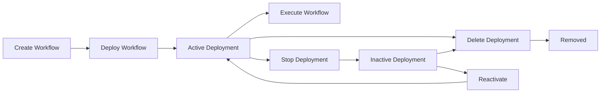

# Workflow Deployment Management Guide

This guide covers how to deploy, manage, and undeploy workflows in the Agent Studio system.

## 🚀 **Deployment Operations**

### **1. Deploy a Workflow**

Deploy a workflow to make it available for execution:

```bash
POST /api/workflows/{workflow_id}/deploy
```

**Request Body:**
```json
{
  "deployment_name": "my_workflow_deployment",
  "environment": "production",
  "deployed_by": "user@example.com",
  "runtime_config": {
    "timeout": 300,
    "max_retries": 3
  }
}
```

**Response:**
```json
{
  "deployment_id": "550e8400-e29b-41d4-a716-446655440000",
  "deployment_name": "my_workflow_deployment",
  "environment": "production",
  "status": "active",
  "deployed_at": "2025-05-30T23:15:43.218394",
  "workflow": { ... }
}
```

### **2. List Active Deployments**

Get all currently active workflow deployments:

```bash
GET /api/workflows/deployments/active
```

**Response:**
```json
[
  {
    "deployment_name": "toshiba_deployment_1748634073",
    "environment": "development",
    "status": "active",
    "deployed_at": "2025-05-30T19:41:13.309897",
    "execution_count": 5,
    "error_count": 0,
    "workflow": {
      "name": "toshiba_single_agent_1748634073",
      "workflow_id": "19bb0997-d056-4505-b50e-e90a342ae58b"
    }
  }
]
```

## 🛑 **Undeploy Operations**

### **1. Stop Deployment (Soft Undeploy)**

Stop a deployment while keeping the record in the database:

```bash
POST /api/workflows/deployments/{deployment_name}/stop
```

**What it does:**
- ✅ Sets deployment status to "inactive"
- ✅ Records stopped_at timestamp
- ✅ Removes from active workflows memory
- ✅ Keeps deployment record in database
- ✅ Preserves execution statistics

**Response:**
```json
{
  "message": "Deployment 'my_deployment' stopped successfully",
  "deployment_id": "335c259c-53db-4a3c-9649-61bf1b2d78a2",
  "status": "inactive",
  "stopped_at": "2025-05-30T23:15:43.218394"
}
```

**Use Cases:**
- Temporary maintenance
- Debugging issues
- Controlled rollback
- Preserving deployment history

### **2. Delete Deployment (Hard Undeploy)**

Completely remove a deployment from the system:

```bash
DELETE /api/workflows/deployments/{deployment_name}
```

**What it does:**
- ✅ Removes from active workflows memory
- ✅ Completely deletes deployment record
- ✅ Removes all deployment statistics
- ⚠️ **Irreversible operation**

**Response:**
```json
{
  "message": "Deployment 'my_deployment' deleted successfully",
  "deployment_id": "335c259c-53db-4a3c-9649-61bf1b2d78a2"
}
```

**Use Cases:**
- Permanent removal
- Cleanup old deployments
- Free up deployment names
- Complete system cleanup

## 🔍 **Environment Handling**

The undeploy endpoints automatically search across environments:

1. **First**: Searches in `development` environment
2. **Fallback**: Searches in `production` environment
3. **Error**: Returns 404 if not found in either

This ensures deployments can be found regardless of their environment.

## 📊 **Deployment Lifecycle**



## 🛠️ **Management Examples**

### **Example 1: Temporary Stop for Maintenance**

```bash
# Stop deployment for maintenance
curl -X POST "http://localhost:8000/api/workflows/deployments/my_deployment/stop"

# Perform maintenance...

# Redeploy when ready
curl -X POST "http://localhost:8000/api/workflows/{workflow_id}/deploy" \
  -H "Content-Type: application/json" \
  -d '{"deployment_name": "my_deployment", "environment": "production"}'
```

### **Example 2: Complete Cleanup**

```bash
# List all active deployments
curl "http://localhost:8000/api/workflows/deployments/active"

# Delete specific deployment
curl -X DELETE "http://localhost:8000/api/workflows/deployments/old_deployment"

# Verify removal
curl "http://localhost:8000/api/workflows/deployments/active"
```

### **Example 3: Batch Cleanup Script**

```python
import requests

BASE_URL = "http://localhost:8000"

# Get all active deployments
response = requests.get(f"{BASE_URL}/api/workflows/deployments/active")
deployments = response.json()

# Stop all test deployments
for deployment in deployments:
    if "test_" in deployment["deployment_name"]:
        print(f"Stopping {deployment['deployment_name']}")
        requests.post(f"{BASE_URL}/api/workflows/deployments/{deployment['deployment_name']}/stop")
```

## ⚠️ **Important Considerations**

### **Stop vs Delete**

| Operation | Database Record | Statistics | Reversible | Use Case |
|-----------|----------------|------------|------------|----------|
| **Stop** | ✅ Kept | ✅ Preserved | ✅ Yes | Temporary maintenance |
| **Delete** | ❌ Removed | ❌ Lost | ❌ No | Permanent cleanup |

### **Memory Management**

Both stop and delete operations automatically clean up the `ACTIVE_WORKFLOWS` memory cache to prevent:
- Memory leaks
- Stale deployment references
- Execution attempts on stopped deployments

### **Error Handling**

- **404 Not Found**: Deployment doesn't exist in any environment
- **500 Internal Server Error**: Database or system error during operation
- **Automatic Rollback**: Failed operations don't leave partial state

## 🎯 **Best Practices**

1. **Use Stop for Temporary Issues**
   - Debugging problems
   - Planned maintenance
   - Testing changes

2. **Use Delete for Permanent Cleanup**
   - Old/unused deployments
   - Failed deployments
   - System cleanup

3. **Monitor Active Deployments**
   - Regular cleanup of unused deployments
   - Monitor execution statistics
   - Track deployment health

4. **Environment Management**
   - Use descriptive deployment names
   - Include environment in naming convention
   - Document deployment purposes

## 🔧 **Troubleshooting**

### **Deployment Not Found**
```bash
# Check if deployment exists in any environment
curl "http://localhost:8000/api/workflows/deployments/active" | grep "my_deployment"

# Try both environments explicitly
curl -X POST "http://localhost:8000/api/workflows/deployments/my_deployment/stop"
```

### **Memory Cleanup Verification**
After stopping/deleting deployments, verify they're removed from memory by attempting execution:

```bash
# This should return 404 for stopped/deleted deployments
curl -X POST "http://localhost:8000/api/workflows/execute" \
  -H "Content-Type: application/json" \
  -d '{"deployment_name": "stopped_deployment", "query": "test"}'
```

The undeploy functionality provides flexible deployment management while maintaining system integrity and performance! 🎉
